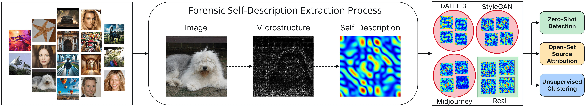
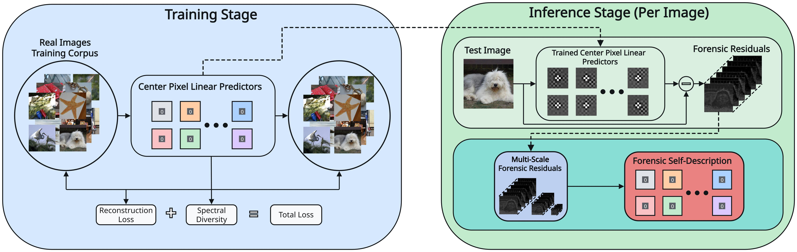

# Forensic Self-Descriptions (FSD)

[](https://cvpr.thecvf.com/)
[](https://arxiv.org/abs/2503.21003)
[](https://creativecommons.org/licenses/by-nc-sa/4.0/)
[](https://arxiv.org/abs/2503.21003)

**Zero-shot AI-generated image detection -- trained only on real images, generalizes to any unseen generator.**

Official implementation of **"Forensic Self-Descriptions Are All You Need for Zero-Shot Detection, Open-Set Source Attribution, and Clustering of AI-generated Images"** (CVPR 2025).

<p align="center">
  
</p>

<p align="center">
  
</p>

## Updates

- **2026-02**: Released inference code and pre-trained model weights for AI-generated image detection.

## Roadmap

- [ ] Code for open-set source attribution
- [ ] Code for unsupervised clustering

## Overview

FSD is a self-supervised forensic method that detects AI-generated images without needing to train on any specific generator. It works by:

1. **Forensic Residual Extraction (FRE)**: Constrained prediction-error filters extract pixel-level forensic residuals
2. **Multi-scale FSD computation**: Residuals are analyzed across scales to produce a compact 960-dimensional forensic descriptor
3. **GMM scoring**: A Gaussian Mixture Model scores each descriptor, yielding a z-score where more negative values indicate AI-generated content

## Results

FSD achieves **state-of-the-art** zero-shot synthetic image detection while being **completely zero-shot** -- it is trained **only on real images** and has never seen any synthetic image during training. Unlike most competing methods which require synthetic training data from specific generators, FSD generalizes to any generator out of the box.

**Zero-shot detection performance** (average AUC across 24 generators including ProGAN, StyleGAN 1-3, GigaGAN, GLIDE, Stable Diffusion 1.5-3.0, DALLE, Midjourney, Firefly, etc.):

| Method | Training Data | COCO17 | IN-1k | IN-22k | MIDB | Average |
|--------|:---:|:---:|:---:|:---:|:---:|:---:|
| CNNDet | Real + Synthetic | 0.756 | 0.714 | 0.733 | 0.683 | 0.722 |
| PatchFor | Real + Synthetic | 0.833 | 0.823 | 0.845 | 0.790 | 0.823 |
| UFD | Real + Synthetic | 0.903 | 0.862 | 0.815 | 0.612 | 0.798 |
| LGrad | Real + Synthetic | 0.819 | 0.770 | 0.866 | 0.824 | 0.820 |
| DE-FAKE | Real + Synthetic | 0.765 | 0.749 | 0.617 | 0.791 | 0.731 |
| Aeroblade | Training-Free | 0.728 | 0.741 | 0.582 | 0.646 | 0.674 |
| ZED | Real Only | 0.751 | 0.676 | 0.716 | 0.747 | 0.723 |
| NPR | Real + Synthetic | 0.945 | 0.900 | 0.900 | 0.957 | 0.926 |
| **Ours (FSD)** | **Real Only** | **0.968** | **0.962** | **0.941** | **0.971** | **0.960** |

See [the paper](https://arxiv.org/abs/2503.21003) for full results on source attribution and clustering.

## Installation

This project uses [uv](https://docs.astral.sh/uv/) for dependency management.

```bash
git clone https://github.com/ductai199x/Forensic-Self-Descriptions-CVPR25.git
cd Forensic-Self-Descriptions-CVPR25

# Install dependencies and create virtual environment
uv sync

# Activate the virtual environment
source .venv/bin/activate
```

## Quick Start

### Python API

```python
from fsd import FSDDetector

detector = FSDDetector.load("weights/")
result = detector.score("photo.jpg")

print(result.z_score)   # e.g., -3.5 (negative = likely fake)
print(result.is_fake)   # True/False based on threshold
```

Score multiple images:
```python
results = detector.score_batch(["img1.jpg", "img2.png", "img3.webp"])
for path, result in zip(paths, results):
    print(f"{path}: z={result.z_score:.4f} {'FAKE' if result.is_fake else 'REAL'}")
```

### Command Line

```bash
# Single image
fsd-score photo.jpg

# Multiple images
fsd-score img1.jpg img2.png img3.webp

# Directory of images
fsd-score --dir path/to/images/

# Custom threshold (default: -2.0, more negative = stricter)
fsd-score photo.jpg --threshold -3.0

# Use GPU
fsd-score photo.jpg --device cuda

# CSV output
fsd-score --dir images/ --csv > results.csv
```

### Multi-GPU / Ray Serve

For scoring large batches across multiple GPUs, start the Ray Serve service first, then score images against it:

```bash
# Start the scoring service (auto-detects GPUs)
fsd-score-ray serve

# In another terminal, score images against the running service
fsd-score-ray score photo.jpg
fsd-score-ray score --dir path/to/images/ --csv > results.csv
```

Configure the service:
```bash
# Custom port and GPU allocation
fsd-score-ray serve --port 9000 --num-gpus 4 --gpu-per-replica 0.5

# Score against non-default port
fsd-score-ray score --url http://localhost:9000 --dir images/
```

You can also query the service directly via HTTP:
```bash
curl -X POST http://localhost:8000 \
  -H "Content-Type: application/json" \
  -d '{"path": "/absolute/path/to/image.jpg"}'
```

## Interpreting Results

The detector outputs a **z-score** for each image:
- **z > -2**: Likely real
- **z < -2**: Likely AI-generated (default threshold)
- **z < -3**: High confidence AI-generated

## Pre-trained Weights

Pre-trained weights are included in the `weights/` directory:
- `fre.pt` -- Forensic Residual Extractor (constrained convolution, ~10 KB)
- `gmm.pt` -- Gaussian Mixture Model (K=5, tied covariance, ~15 MB)
- `fsd_transforms.pt` -- Learned feature transform weights (~34 MB)
- `config.json` -- Model configuration and scoring parameters

## Citation

If you find this work useful, please cite:

```bibtex
@InProceedings{Nguyen_2025_CVPR,
    author    = {Nguyen, Tai D. and Azizpour, Aref and Stamm, Matthew C.},
    title     = {Forensic Self-Descriptions Are All You Need for Zero-Shot Detection, Open-Set Source Attribution, and Clustering of AI-generated Images},
    booktitle = {Proceedings of the IEEE/CVF Conference on Computer Vision and Pattern Recognition (CVPR)},
    month     = {June},
    year      = {2025},
    pages     = {3040-3050}
}
```

## Acknowledgments

This work was conducted at the [Multimedia Information Security Lab (MISL)](https://misl.ece.drexel.edu/) at Drexel University under the supervision of Dr. Matthew C. Stamm.

## License

This project is licensed under [CC BY-NC-SA 4.0](https://creativecommons.org/licenses/by-nc-sa/4.0/) -- research use only, no commercial use, share-alike.
